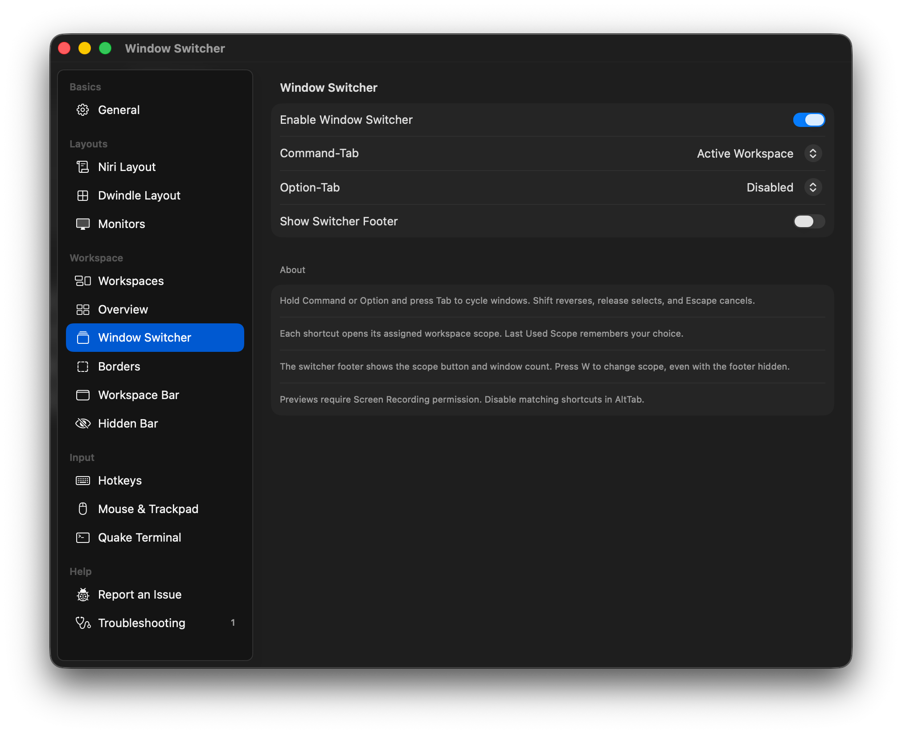
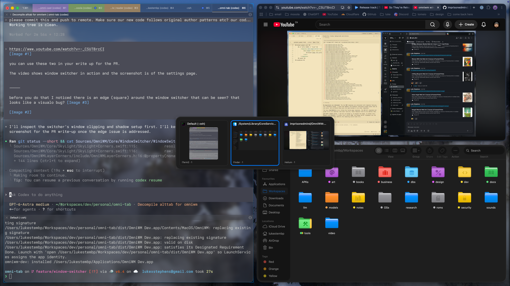

# Window switcher

Enable **Settings → Window Switcher → Enable Window Switcher** to switch individual windows with thumbnail previews. Disable matching bindings in AltTab first. The feature is off by default, including when loading an existing OmniWM configuration.

Configure **Command-Tab** and **Option-Tab** independently. Each can open **Active Workspace**, **All Workspaces**, **Last Used Scope**, or be **Disabled**. New configurations default to Command-Tab for the active workspace and Option-Tab for all workspaces. Older switcher configurations retain Command-Tab with the remembered scope and leave Option-Tab disabled.

| Input | Action |
| --- | --- |
| Hold Command or Option, press Tab | Open the configured scope and select the next recently focused window |
| Tab / Shift-Tab | Cycle forward / backward, wrapping at either end |
| Arrow keys | Cycle forward / backward |
| Release the modifier used to open the switcher, or Return | Focus the selected window |
| Escape or click outside | Cancel without selecting a window |
| Click a thumbnail | Focus that window |
| W or the workspace scope button | Toggle all workspaces / active workspace and remember the choice |

**Show Switcher Footer** controls the scope button and window count together, independently of shortcut assignments. It is on by default. Turning it off removes the footer and its space beneath the previews; W still changes scope. An empty workspace still shows a message.

A shortcut assigned to a fixed scope always starts there next time, even after changing scope. **Last Used Scope** opens the saved `scope`, which the button and W update. For the original single-shortcut workflow, set Command-Tab to **Last Used Scope** and Option-Tab to **Disabled**. The Remembered Scope setting appears when either shortcut uses Last Used Scope. Disabling Command-Tab leaves macOS’s normal application switcher available.

**All Workspaces** includes windows tracked by OmniWM across monitors and workspaces, including floating windows and hidden applications. **Active Workspace** uses the workspace on the interaction monitor when the switcher opens. The list stays in its initial recency order while cycling. Closing or moving a window is checked again before cycling or committing a selection. Opening the switcher again refreshes the inventory.

The panel displays a bounded row around the selection; continuing to press Tab reaches every candidate. Thumbnails are captured on demand for the visible row, once per presentation, using the existing Overview capture service. Capture work and retained images are released on dismissal. Missing permission and unavailable captures are labeled explicitly. Screen Recording permission is required for thumbnails; keyboard selection remains available without it.

Minimized or natively withdrawn windows and windows excluded from OmniWM’s tracked inventory are omitted. This feature does not duplicate AltTab’s independent application/window discovery. ScreenCaptureKit may not provide a preview for every offscreen or native fullscreen window; those windows retain their title and an explicit unavailable-preview label.

## Configuration



```toml
[windowSwitcher]
enabled = true
commandTab = "activeWorkspace"
optionTab = "allWorkspaces"
showFooter = true # scope button and window count
scope = "allWorkspaces" # remembered scope for shortcuts assigned to "remembered"
```

`commandTab` and `optionTab` accept `"activeWorkspace"`, `"allWorkspaces"`, `"remembered"`, or `"disabled"`. Shortcut changes cancel any open switcher. Releasing Shift or an unrelated modifier does not commit a selection; only releasing the modifier that opened it does.

Enabled shortcuts are intercepted through OmniWM’s existing input event tap. Input Monitoring must be granted. Disabling OmniWM’s hotkeys, entering Secure Input, locking the screen, stopping services, or losing the event tap cancels the current presentation. Overview and the command palette must be closed before invoking the switcher.

## Source investigation

Reviewed upstream revisions:

- [OmniWM 9fae5f7](https://github.com/OmniNull/OmniWM/tree/9fae5f76e77b01d54be501a3df8832e766a29dcc)
- [AltTab 0d9d710](https://github.com/lwouis/alt-tab-macos/tree/0d9d710779333b1b2279f04b53d919fb35557120)

AltTab publishes its source, so decompilation is unnecessary. Its `src/events/KeyboardEvents.swift` handles cycling and modifier release. `src/events/WindowCaptureEvents.swift` discovers shareable windows, caches capture metadata, and requests previews with ScreenCaptureKit, with an older capture path for older systems.

OmniWM already provides the main integration points:

- `WorkspaceManager.allEntries()` and `windowFocusRecencyOrder`: tracked windows, workspace ownership, and recency.
- `OverviewThumbnailCapture`: bounded capture startup, window identity checks, preview delivery, and cleanup.
- `WindowActionHandler.activateExplicitlySelectedWindow`: the activation path shared with the workspace bar, including workspace navigation, application reveal, and native fullscreen activation.
- `HotkeyCenter`: the existing keyboard event tap and lifecycle.
- `OwnedWindowRegistry` and `FocusPolicyEngine`: capture exclusion and suppression of mouse-driven focus during selection.

The implementation is original code using these OmniWM components. No AltTab source or assets were copied. The inspected AltTab repository carries GPLv3; OmniWM declares GPL-2.0-only.

## Developer validation

The contributor built and exercised the development app and confirmed the rounded-corner fix. The screenshots and [demo video](https://www.youtube.com/watch?v=-_CSUTBrcCI) show the switcher before that visual fix.



Follow [CONTRIBUTING.md](../CONTRIBUTING.md) for dependency setup and the development app. This branch has focused input, selection, persistence, and focus-lease tests. Before using the replacement, run `make verify`, `swift test`, and `swift test --parallel` with the required dependencies installed.

Manually check both shortcuts, fast modifier release, held-key repetition, reverse cycling, Escape, scope changes across two monitors, selection on an inactive workspace, a window closing during selection, hidden applications, native fullscreen, missing Screen Recording permission, and more windows than fit in the row. Check that fixed-scope shortcuts reset after using the scope button, remembered-scope shortcuts retain the button choice, and disabled shortcuts pass through. Confirm stopping OmniWM restores normal Command-Tab behavior. The full validation checklist and automated test suite have not yet been run.
